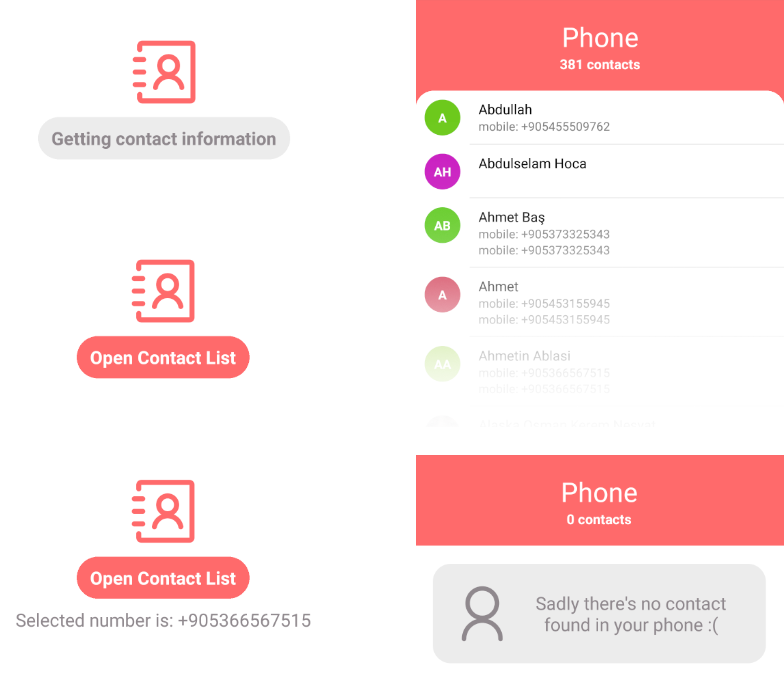

# Introduction

This is the repository that I've used while developing Contact List App for Column/ as a interview task.

While I was working for this task, I used Trello as my personal task manager and throughout this progress I tried to write detailed explanations, created notes for each update that happened during the process, explained how I proceeded from start to finish. You can see everything I've done for the past 4 days hour by hour. Also I linked that board with my GitHub account so you can see each tasks corresponding commit in order to understand how I progressed.

I'll be glad if you would check this out: [Contact List App Trello Board](https://trello.com/b/Qz7bTMAH/contact-list-app)

## Running the project

- Clone this project

```
git clone < project-url.git >
```

- [Install NodeJS and npm](https://docs.npmjs.com/downloading-and-installing-node-js-and-npm) on your computer.

- Launch `npm install` command in a terminal opened in the project folder.

  > This command will look into the _package.json_ file and install all the dependencies listed here.

- Install react-native-cli globally on your computer

```
npm install -g react-native-cli
```

### Android steps

- Launch a virtual android device (through _Android Studio_ or terminal using _emulator -avd < Emulator_Name (Pixel_2_API_28) >_)

> If you have never installed any android virtual device, [follow those instructions](https://developer.android.com/studio/run/managing-avds.html#createavd)

- Start the JS server by executing this command on your project folder:

```
npx react-native start
```

- Then, in another terminal run the project by executing this command on your project folder:

```
npx react-native run-android
```

### iOS Disclaimer

Unfortunately I didn't have a chance to test this project on iOS devices because I don't have a Mac and iPhone so while I'm installing dependencies I couldn't do iOS installation parts of them because of this reason the app may not work on iOS.

## Folder Structure

### Source directory layout

    .
    ├── ...
    ├── src
    │   ├── components                      # All of my components here
    │   ├── constants                       # Global constants such as Colors, Sizes
    │   ├── navigation                      # Navigation related files
    │   ├── redux                           # All redux related files
    │   ├── utils                           # Utility (helper) functions
    │   └── ...
    └── ...

### Component directory

    .
    ├── ...
    ├── components
    │   ├── ContactBook                     # Renders a button and if exists, selected contact's phone
    │   ├── ContactList                     # Renders the list of contacts
    │   ├── CustomButton                    # Is used for navigating to Contact List Screen
    │   ├── Icon                            # Is used to render icons from react-native-vector-icons/AntDesign
    │   ├── ProfilePicture                  # Renders the profile picture of a contact. (or a placeholder with initials of their name)
    │   └── ...
    └── ...

### Sample component directory (ContactList for example)

    .
    ├── ...
    ├── ContactList                         # All the related components to the ContactList component is here with a styles file
    │   ├── ContactList.js
    │   ├── ContactListHeader.js
    │   ├── ContactListItem.js
    │   ├── styles
    │   └── ...
    └── ...

### Navigation directory

    .
    ├── ...
    ├── navigation
    │   ├── screens                         # All the screen components in this folder
    │   ├── AppNavigation.js                # Main navigation of the app
    │   └── ...
    └── ...

### Redux directory

    .
    ├── ...
    ├── redux
    │   ├── ContactReducer.js               # Is used to store selected contact number globally
    │   ├── store.js                        # Redux store
    │   └── ...
    └── ...

### Utils directory

    .
    ├── ...
    ├── utils
    │   ├── getInitials.js                  # Is used for getting a contacts first and last name's initials
    │   ├── randomColor.js                  # Is used for generating random colors for placeholders for someone's profile picture
    │   ├── requestContactPermission.js     # A promise that requests permission for accessing contacts
    │   ├── useContactLoader.js             # A custom hook for dealing with the contact loading logic
    │   └── ...
    └── ...

# Dependencies

- react-native-vector-icons
- react-native-contacts
- @react-navigation/native, @react-navigation/stack
- react-redux
- redux

# How it looks?

You can see all the possible component states in this image:


